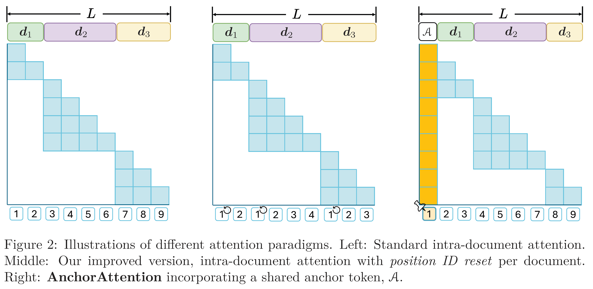

# When Precision Meets Position: BFloat16 Breaks Down RoPE in Long-Context Training
<p align="center">
    
</p>


## What is this?

> **AnchorAttention: Improved attention for LLMs long-context training.**


This repository provides the implementation of **`AnchorAttention`**, a plug-and-play attention mechanism designed to significantly improve the long-context training of Large Language Models (LLMs). AnchorAttention addresses numerical issues that arise when using Rotary Positional Embedding (RoPE) with BFloat16 precision, particularly in long-context scenarios.


### Key Features:

- **Improved Long-Context Performance**: Improves model's long-context performance on RULER and LongBench.
- **Efficient Training**: Reduces training time by over 50% compared to standard full attention mechanisms.
- **Compatibility**: Supports several popular models and integrates with `FlashAttention2` and `FlexAttention` engines for optimized computations.
- **Semantic Coherence**: Maintains the original LLM's capabilities on general tasks while improving performance on long-context tasks.


### How It Works:

AnchorAttention treats the first token in the sequence as a shared **anchor** with a consistent position ID. This approach:

- Reduces unnecessary attention computations by focusing on the anchor token.
- Ensures that all documents within the training context have visibility to the anchor, enhancing information flow.
- Mitigates the numerical issues caused by limited precision in BFloat16 format.

<p align="center">
    
</p>


## Installation
The code is tested on `Python 3.10.0`, `PyTorch 2.5.0.dev20240912+cu121` / `2.6.0.dev20241112+cu121`, and `CUDA 12.1`.

```bash
conda create -n anchorcontext python=3.10 -y && conda activate anchorcontext
pip install torch==2.6.0.dev20241112+cu121 --index-url https://download.pytorch.org/whl/nightly/cu121
pip install packaging &&  pip install ninja && pip install flash-attn==2.5.6 --no-build-isolation --no-cache-dir
pip install yunchang==0.2   # directly ```pip install yunchang``` if you are using flash_attn >= 2.6.0
git clone https://github.com/haonan3/AnchorContext.git
cd AnchorContext
pip install -r requirements.txt
python anchor_context/library_modified_files/softlink_to_library.py
```

For our Flexattention experiment presented in the paper, we originally used PyTorch version `2.5.0.dev20240912+cu121`. However, since this version is now archived and no longer directly available, we recommend using `2.6.0.dev20241112+cu121` instead.

### Why Specific Torch Versions?
- **Archived Version (`2.5.0.dev20240912+cu121`):**
  - Used in our paper for the FLEX experiment.
  - Currently archived and not directly accessible.

- **Recommended Development Version (`2.6.0.dev20241112+cu121`):**
  - Serves as a suitable alternative to the archived version.
  - Ensures compatibility and optimal performance without additional configuration.

- **Stable Versions (`2.5.0` & `2.5.1`):**
  - Widely used and stable.
  - Require calling `torch._dynamo.reset()`, which may slightly reduce performance.


## Training

Refer to the [`demo_llama.sh`](./demo_llama.sh) script for a training example.

### Supported Input Data Formats

Our code currently supports two types of input data:

1. **Raw JSON Files**  
   JSON files formatted as `{ "text": "xxxxx" }`.  
   To use raw JSON files as input, include the flag `--data-format raw_json`.

2. **Pre-tokenized Data**  
   Outputs from the [FranxYao/Long-Context-Data-Engineering](https://github.com/FranxYao/Long-Context-Data-Engineering) repository.  
   If you are using the pre-tokenized output from this repository, include the flag `--data-format tokenized`.


## Debug Tool for Code with DeepSpeed

To facilitate your development process, we provide a debug tool that can be easily integrated into your other projects. Debugging DeepSpeed code using VSCode can be challenging, so we have developed a tool included in the `util.py` file.

#### How to Use the Debug Tool

1. **Enable Debugging:**
   
   Add the following line to `demo_llama.sh` to enable the debug tool:
   
   ```bash
   export DEBUGPY=1
   ```

2. **Setup Debugging in `train.py`:**
   
   Locate the `setup_debugpy` function call in `train.py` to initialize the debugger.

3. **Configure VSCode:**
   
- Ensure your `launch.json` is set up to use the **Attach** mode. You can use `.vscode/launch.json` as a demo.

4. **Attach the Debugger in VSCode:**

- Run `bash demo_llama.sh`.
- Open VSCode and go to the **Run and Debug** panel.
- Select the **Attach** configuration from your `launch.json`.
- Start the debugger to connect to the specified `endpoint` and `port`.

    (Once attached, you can set breakpoints, inspect variables, and step through the code as needed.)


#### Debugging Function

Below is the `setup_debugpy` function from `util.py` that sets up the debug server:

```python
def setup_debugpy(accelerator, endpoint="localhost", port=5678, rank=0, force=False):
    if "DEBUGPY" not in os.environ:
        print(colored("DEBUGPY not in os.environ", "red"))
        return
    rank = int(os.getenv("DEBUGPY_RANK", rank))
    port = int(os.getenv("DEBUGPY_PORT", port))
    endpoint = os.getenv("DEBUGPY_ENDPOINT", endpoint)
    if accelerator.process_index != rank:
        accelerator.wait_for_everyone()
        return
    if force:
        print(colored("Force killed debugpy", "red"))
    try:
        debugpy.listen((endpoint, port))
        print(colored(f"Waiting for debugger attach on {endpoint}:{port}", "red"))
        debugpy.wait_for_client()
    except:
        print(colored(f"Failed to setup debugpy, {endpoint}:{port} occupied", "red"))

    accelerator.wait_for_everyone()
```

#### Notes

- **Port Configuration:** Ensure that the port specified (default is `5678`) is open and not used by other applications.
- **Rank Configuration:** The `rank` parameter ensures that the debugger attaches only to the specified process in distributed training scenarios.